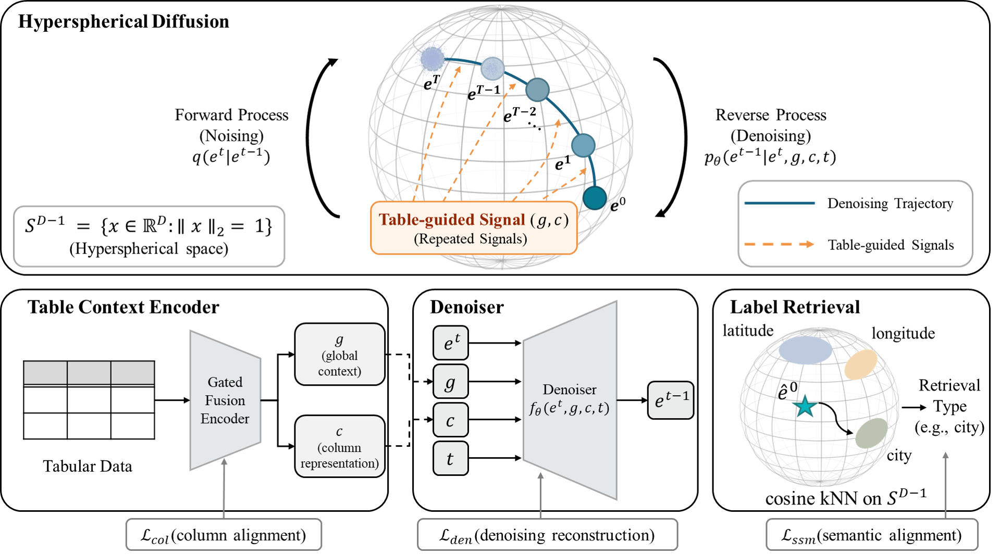

# Table-Guided Hyperspherical Diffusion for Preserving Semantic Dependencies in Column Type Annotation

---

## Overview

<p align="center">
  
</p>

We propose a **table-guided hyperspherical diffusion framework for Column Type Annotation (CTA) within Semantic Table Interpretation (STI)**. Unlike conventional discriminative approaches, our framework generates column type representations through iterative denoising in hyperspherical space, guided by table-level context and column representations.

---

## ✨ Key Components

| Component | Description |
|---|---|
| **Table Context Encoder** | Learns contextualized column representations for both categorical and numerical columns, while extracting table-level contextual signals |
| **Hyperspherical Diffusion Denoiser** | Progressively refines noisy semantic representations through iterative denoising conditioned on table-guided signals |
| **Semantic Label Retrieval** | Retrieves final semantic types via cosine similarity over the hyperspherical label space |

---

## 🚀 Installation

### Requirements

```
Python  >= 3.10
PyTorch >= 2.0
```

---

## 📂 Datasets

We evaluate on four public CTA benchmark datasets:

| Dataset | # Tables | # Types | Download |
|---|---|---|---|
| GitTables-DBpedia | 3,737 | 101 | [SemTab 2022](https://sem-tab-challenge.github.io/2022/) |
| GitTables-Schema | 2,853 | 53 | [SemTab 2022](https://sem-tab-challenge.github.io/2022/) |
| SOTAB-CTA | 24,275 | 91 | [WDC SOTAB](https://webdatacommons.org/structureddata/sotab/) |
| WikiTables-CTA | 406,705 | 150 | [TabEL](http://websail-fe.cs.northwestern.edu/TabEL/) |

Place the downloaded datasets under the following structure:

```
data/
├── GitTables-DB/
├── GitTables-Schema/
├── SOTAB-CTA/
└── WikiTables-CTA/
```


---

## 🏋️ Training

```bash
python train.py --data GitTables-DB
```

---

## 📊 Test

```bash
python test.py \
  --data GitTables-DB \
  --checkpoint checkpoints/model.pt
```

---

## 📈 Results

Our framework consistently outperforms discriminative and LLM-based baselines across all benchmarks.

| Dataset | Micro-F1 | Macro-F1 |
|---|:---:|:---:|
| GitTables-DBpedia | **56.18** | **31.91** |
| GitTables-Schema | **66.42** | **40.23** |
| SOTAB-CTA | **87.50** | **86.46** |
| WikiTables-CTA | **93.37** | **73.19** |

